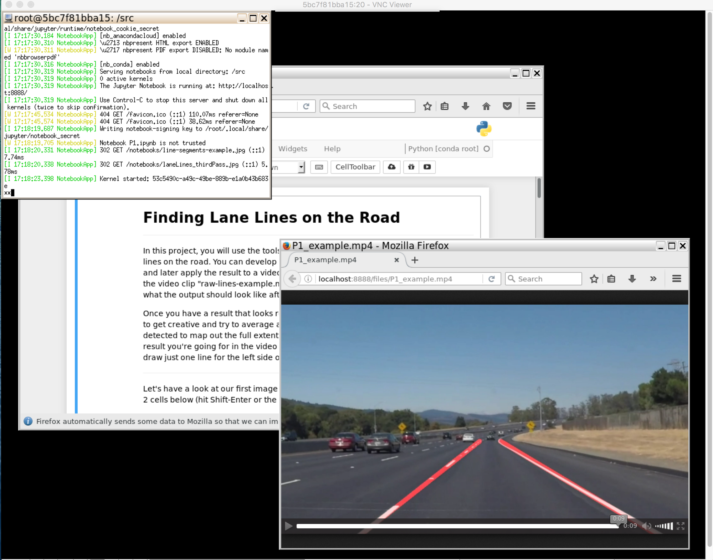

# udacity-carnd

Creates a Docker image with all the prerequisites needed to run the projects of the [Udacity Self-Driving
Car Nanodegree](https://www.udacity.com/course/self-driving-car-engineer-nanodegree--nd013).

This image is based on the [dev-machine image](https://github.com/yrahal/dev-machine), and extends it by
adding Anaconda3, OpenCV, TensorFlow, Keras, uWebSockets, cppad, ipopt, etc as instructed in the nanodegree.
I have used it to successfully complete
[all projects of the first and second terms](https://github.com/yrahal/udacity-sdcnd).

This image can be launched in CLI mode, in UI mode via a TurboVNC server that you can connect to, or as a 
jupyter server. Or in a variety of other situations.

The most useful way to launch it, is probably as a jupyter server. The image has a useful script baked in,
that you can run as:

`$ docker run -it -v $PWD:/src -p 8888:8888 yrahal/udacity-carnd bash /bin/run_jupyter.sh`

You can then open `localhost:8888` in your browser and execute your notebooks, assuming your notebooks
can be found under the current directory hierarchy.

You can also refer to the instructions from the
[`dev-machine` repository](https://github.com/yrahal/dev-machine/blob/master/README.md) for extra information on
usage. The notable differences is that `yrahal/dev-machine` must be replaced by `yrahal/udacity-carnd`
and that the default user in `yrahal/udacity-carnd` is... `kitt`.

You might also find this
[Medium post](https://medium.com/@YoucefRahal/docker-image-for-the-udacity-self-driving-car-nanodegree-with-ui-995d58ab92d6)
and this [YouTube video](https://www.youtube.com/watch?v=PUGERKPzFD4) useful.

## Files
* `run.sh`: Script provided for convenience to run the image with some useful mappings:
  * Runs the image with a TurboVNC server and maps the container's `5901` port to the same one on
  the host. It also maps the `8888` jupyter and `4567` simulator ports to that of the host.
  * Maps the current directory on the host to `/src` on the container (which is the default working
  directory).
  * Maps the Docker volume `kitt_home` to the `kitt` home directory on the container. This volume
  exists on the host and is created on the first run. This is useful to persist the preferences
  between sessions, but is not required.
* `run_jupyter.sh`: Another script provided for convenience, which mimics the previous one except:
  * Runs a jupyter server by default. So no TurboVNC server is launched. Therefore, only the 
    `8888` port is mapped.
* `build.sh`: Script to build the image from the `Dockerfile`.
* `Dockerfile`: File used to build the image. This image is hosted on Docker Hub as
[`yrahal/udacity-carnd`](https://hub.docker.com/r/yrahal/udacity-carnd).
